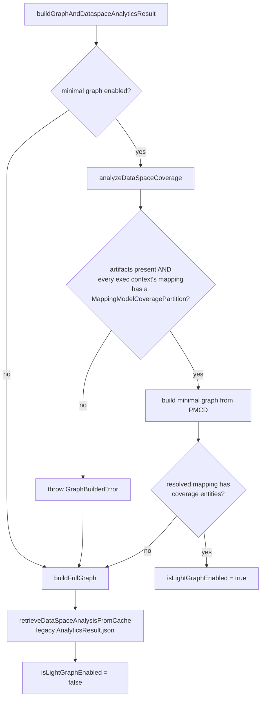

# Legend Query — Data Space Analytics, the Minimal Graph, and Entry Points

> Technical reference for `@finos/legend-application-query`.
>
> Audience: engineers working on Legend Query, the Data Space DSL extension
> (`@finos/legend-extension-dsl-data-space`), or the query builder
> (`@finos/legend-query-builder`).

This document explains:

1. [Why data space analytics exists](#1-why-data-space-analytics-exists) — the cost model that motivates it.
2. [The minimal graph](#2-the-minimal-graph) — what is cached, how it is keyed, and when it is used.
3. [Entry points into Legend Query](#3-entry-points-into-legend-query) — every route that can open the query editor, and how each one builds its graph.
4. [Saved query types](#4-saved-query-types) — how each entry point persists a query, and how the editor reconstitutes it.

---

## 1. Why data space analytics exists

### 1.1 The cost of a full graph

Legend Query's query builder operates on a **PURE graph** — a fully resolved,
in-memory metamodel. Historically, opening the editor meant:

1. Fetch **every entity** of the project version from the depot server.
2. Fetch **every entity of every dependency** (transitively).
3. Deserialize the protocol models (`V1_*`) and run the graph builder, which
   resolves every reference (property types, association ends, mapping source
   classes, store/connection pointers, …) into real metamodel objects.

For a large enterprise project with deep dependency trees, this dominates
time-to-first-interaction. And most of it is wasted work: to build a query
against a data space, the user needs the **classes reachable from one mapping**
plus the mapping/runtime pointers — not the whole model, not the persistence
pipelines, not the other 40 mappings in the project.

### 1.2 The insight

A data space is a curated, published surface over a project:

- a fixed set of **execution contexts**, each pinning a `mapping` + `defaultRuntime`
- a documented model
- a set of executables (templates, services, functions)

All of that is **known at project build time**. It does not depend on who opens
it or what they intend to query. So it can be computed once, in the engine, at
publish time — and stored alongside the project version in the depot server as
a **file generation artifact**.

Legend Query then reads that artifact instead of recomputing it. That is
"data space analytics".

### 1.3 What analytics buys us

| Without analytics                                                                         | With analytics                                                    |
| ----------------------------------------------------------------------------------------- | ----------------------------------------------------------------- |
| Fetch all project + dependency entities                                                   | Fetch one (small) set of artifact files, scoped to the data space |
| Build the full graph                                                                      | Build a graph containing only the classes the mapping covers      |
| Run mapping model coverage analysis against the engine (a network round trip per mapping) | Read the pre-computed coverage result out of the artifact         |
| Compute element documentation, diagrams, executables client-side                          | Read them out of the artifact                                     |

The artifacts are produced by the engine's artifact-generation extension keyed
`dataSpace-analytics`, and retrieved through
[`DataSpaceAnalysisHelper.ts`](../../legend-extension-dsl-data-space/src/graph-manager/action/analytics/DataSpaceAnalysisHelper.ts):

- `retrieveAnalyticsResultCache(...)` → the single legacy `AnalyticsResult.json` blob
- `retrieveDataspaceArtifactsCache(...)` → the **partitioned** artifact set (see below)

---

## 2. The minimal graph

### 2.1 Artifact layout

The engine emits the analytics for a data space as **several files**, not one.
This partitioning is what makes the minimal graph possible.

| Artifact                           | Type                         | Contents                                                                                                                                                                                                                       |
| ---------------------------------- | ---------------------------- | ------------------------------------------------------------------------------------------------------------------------------------------------------------------------------------------------------------------------------ |
| `AnalyticsResult.json`             | `V1_DataSpaceAnalysisResult` | Data space metadata: title, description, tagged values, stereotypes, support info, **execution contexts** (name → mapping, defaultRuntime, compatibleRuntimes, datasets, mappingProvider), element docs, diagrams, executables |
| `MappingAnalysisCoveragePartition` | one per mapping              | `V1_MappingModelCoverageAnalysisResult` — the _coverage_ (which classes/properties the mapping maps, and how)                                                                                                                  |
| `MappingModelCoveragePartition`    | one per mapping              | `model`: a **`V1_PureModelContextData`** containing exactly the model elements the mapping covers                                                                                                                              |

Defined in
[`V1_DataSpaceArtifacts.ts`](../../legend-graph/src/graph-manager/protocol/pure/v1/engine/artifactGeneration/V1_DataSpaceArtifacts.ts).

The split matters for two reasons:

- **Size.** The data space entity itself is _excluded_ from `AnalyticsResult.json`
  (Legend Query reconstructs a synthetic `V1_DataSpace` from the analysis result
  instead — see `buildDataSpaceAnalytics`). Coverage models are the bulk of the
  payload, and they are only fetched per-mapping.
- **Granularity.** The user picks one execution context at a time, which pins
  one mapping. Only that mapping's `MappingModelCoveragePartition` is needed to
  build a graph the query builder can work against.

> A developer-only diagnostic route,
> `/dev/dataspace-inspector` ([`DataSpaceArtifactInspector.tsx`](../src/components/DataSpaceArtifactInspector.tsx)),
> exists to inspect the sizes of these artifacts for a given GAV + data space.

### 2.2 "Cached minimal graph based on mapped classes"

The `MappingModelCoveragePartition.model` PMCD **is** the minimal graph seed.
It contains the model elements the mapping actually covers — the closure of
classes (and the enumerations, associations, and types they reach) reported by
mapping model coverage analysis, not the project's whole model.

Building the graph from it (in
[`V1_DSL_DataSpace_PureGraphManagerExtension.buildDataSpaceAnalytics`](../../legend-extension-dsl-data-space/src/graph-manager/protocol/pure/v1/V1_DSL_DataSpace_PureGraphManagerExtension.ts)):

```
graphEntities =
    pmcd.elements                    // the mapped model closure
  + stub V1_Mapping per exec context // name/package only — no mapping body
  + stub V1_PackageableRuntime       // name/package + empty V1_EngineRuntime
  + stub V1_DataProduct              // for mappingProvider-backed contexts
  + synthetic V1_DataSpace           // rebuilt from the analysis result
  - anything already in the graph    // i.e. system elements
```

then `graphManager.buildGraph(graph, graphEntities, …, { origin: LegendSDLC(gav) })`.

The mappings and runtimes are deliberately **stubs**: the query builder only
needs them as resolvable `PackageableElementReference` targets for the execution
context and for `RuntimePointer`. The real mapping body and connection details
are never needed client-side — execution is delegated to the engine, which
resolves them from the GAV origin stamped on the graph.

Two optional enrichments run afterwards, each independently failure-tolerant:

- `processFunctionForMinimalGraph(...)` — fetches only entities classified
  `CORE_PURE_PATH.FUNCTION` for the project + dependencies, so the explorer can
  offer usable functions. Populates `functionInfos` / dependency function infos.
- `processRuntimeInfo(...)` — fetches entities classified `CORE_PURE_PATH.RUNTIME`
  to enrich the default runtime's info.

Both are wrapped in `try { … } catch { /* do nothing */ }`: losing function
suggestions is preferable to failing the editor load.

### 2.3 The decision flow

`QueryEditorStore.buildGraphAndDataspaceAnalyticsResult(...)`
([`QueryEditorStore.ts`](../src/stores/QueryEditorStore.ts)) is the single
entry point for every data-space-backed flow. It returns
`{ dataSpaceAnalysisResult, isLightGraphEnabled }`.



Two gates control whether the minimal path is even attempted:

- `applicationStore.config.options.TEMPORARY__enableMinimalGraph` — deployment-level config flag.
- `QueryEditorStore.enableMinialGraphForDataSpaceLoadingPerformance` — an
  observable, per-session toggle. The editor UI exposes it, so a user can force
  a full graph build when the light graph is insufficient
  (see [`QueryEditor.tsx`](../src/components/QueryEditor.tsx)).

**The all-or-nothing check.** In `analyzeDataSpaceCoverage`, the minimal path is
taken only if _every_ execution context in the analysis result has a
corresponding `MappingModelCoveragePartition`:

```ts
cachedAnalysisResult?.executionContexts.every(
  (e) =>
    mappingModelCoveragePartition.find((p) => p.mapping === e.mapping)
      ?.model !== undefined,
);
```

This is conservative on purpose: the user can switch execution contexts inside
the editor, and a partially-covered data space would strand them on a context
that cannot be built. If the check fails, a `GraphBuilderError` is thrown and
caught by the caller, which falls back to the full graph.

**Failure is always safe.** Every failure mode — missing artifacts, deserialization
error, incomplete coverage, missing PMCD for the resolved mapping — sets
`buildFullGraph = true`, discards the graph (`createNewGraph()`), and runs the
full build. The minimal graph is a pure optimization; correctness never depends
on it.

### 2.4 Switching execution context inside the editor

Once the editor is open on a light graph, the graph only contains the classes
of the _initially resolved_ mapping. Switching execution context therefore
requires rebuilding.

That rebuild lives in
[`Core_LegendQueryApplicationPlugin.tsx`](../src/components/Core_LegendQueryApplicationPlugin.tsx)
and mirrors the logic in `buildDataSpaceAnalytics`: it creates a fresh graph,
seeds it with `mappingModelCoverageAnalysisResult.entities` for the newly
selected mapping plus the same stub mappings/runtimes/data space entity, and
rebuilds with the SDLC origin. If anything throws, it falls back to
`editorStore.buildFullGraph()`.

This is why `isLightGraphEnabled` is threaded onto the query builder state
(`LegendQueryDataSpaceQueryBuilderState`): the state has to know whether a
context switch requires a graph rebuild or is already fully covered.

### 2.5 Minimal graphs for data products

Data products (`V1_DataProductArtifact`) follow the same principle with a
different artifact. `AbstractPureGraphManager.analyzeDataProductAndBuildMinimalGraph`
(implemented in
[`V1_PureGraphManager.ts`](../../legend-graph/src/graph-manager/protocol/pure/v1/V1_PureGraphManager.ts))
fetches the data product artifact from the depot and dispatches on access type:

- `MODEL` → `buildModelAccessDataProductAnalysis`
- `NATIVE` → `buildNativeAccessDataProductAnalysis`
- `LAKEHOUSE` → `buildLakehouseAccessDataProductAnalysis`

Each builds a graph containing only what that access path needs. When the
artifact has already been fetched (the common case — the store fetches it to
resolve the mapping path first), `buildDataProductAnalysis` is called directly
to avoid a second round trip.

---

## 3. Entry points into Legend Query

An "entry point" is a route that constructs a concrete `QueryEditorStore`
subclass. Routes are declared in
[`LegendQueryNavigation.ts`](../src/__lib__/LegendQueryNavigation.ts) and
[`DSL_DataSpace_LegendQueryNavigation.ts`](../src/__lib__/DSL_DataSpace_LegendQueryNavigation.ts),
and wired in [`LegendQueryWebApplication.tsx`](../src/components/LegendQueryWebApplication.tsx).

Every store implements the same two hooks:

```ts
abstract initializeQueryBuilderState(stopWatch?): Promise<QueryBuilderState>;
abstract getPersistConfiguration(lambda, options?): QueryPersistConfiguration | undefined;
```

`initializeQueryBuilderState` decides _what kind of query builder_ the user
gets. `getPersistConfiguration` decides _how a saved query is stamped_.

### 3.1 Mapping / Runtime (the "manual" flow)

|               |                                                                                         |
| ------------- | --------------------------------------------------------------------------------------- |
| Route         | `/create/manual/:gav/:mappingPath/:runtimePath`                                         |
| Store         | `MappingQueryCreatorStore` ([`QueryEditorStore.ts`](../src/stores/QueryEditorStore.ts)) |
| Builder state | `MappingQueryBuilderState`                                                              |
| Graph         | **Full graph.** No analytics, no minimal graph.                                         |

The rawest entry point: the user picks a mapping and a runtime directly. There
is no curated surface to derive a minimal model from, so the full project graph
is built. Changing mapping or runtime rewrites the URL (`updateCurrentLocation`)
so the flow stays deep-linkable.

Query search is scoped to the current project **and its dependencies** via
`decorateSearchSpecification`.

### 3.2 Service

|               |                                                                     |
| ------------- | ------------------------------------------------------------------- |
| Route         | `/create-from-service/:gav/:servicePath` (+ optional execution key) |
| Store         | `ServiceQueryCreatorStore`                                          |
| Builder state | `ServiceQueryBuilderState`                                          |
| Graph         | **Full graph.**                                                     |

Opens the editor seeded with an existing service's execution lambda. The store
asserts the service execution is a `PureExecution`, then calls
`initializeWithQuery(service.execution.func)` — which routes unsupported query
shapes into the query builder's "unsupported" handling rather than crashing.

For multi-execution services, the execution key selects the execution context;
changing it rewrites the URL.

Related setup flows that funnel into this: `/setup/clone-service-query`,
`/setup/load-project-service-query`, `/setup/update-existing-service-query`,
`/setup/productionize-query`.

### 3.3 Data space

|               |                                                                                                                                                                    |
| ------------- | ------------------------------------------------------------------------------------------------------------------------------------------------------------------ |
| Route         | `/extensions/dataspace/:gav/:dataSpacePath/:executionContext?` (query params: `runtimePath`, `class`)                                                              |
| Store         | `DataProductQueryCreatorStore` with a `QueryableLegacyDataProduct` ([`DataProductQueryCreatorStore.ts`](../src/stores/data-space/DataProductQueryCreatorStore.ts)) |
| Builder state | `LegendQueryDataSpaceQueryBuilderState`                                                                                                                            |
| Graph         | **Minimal graph** via `buildGraphAndDataspaceAnalyticsResult`                                                                                                      |

> **Naming caveat.** The store and queryable-element classes on this path are
> named `DataProductQueryCreatorStore` / `QueryableLegacyDataProduct`, dating
> from a period when data spaces were surfaced to users as "data products".
> That framing was reverted in
> [#5494](https://github.com/finos/legend-studio/pull/5494): the UI, command
> palette, and info panels for this path all say **Data Space** again, and
> "Data Product" now refers exclusively to the distinct element type in §3.4.
> The class names were left alone, so **read `DataProduct` in an identifier on
> this path as a historical artifact, not as a claim about which element type
> is being queried.** The discriminant that actually matters is the queryable
> element (`QueryableLegacyDataProduct` vs `QueryableDataProduct`) and the
> resulting builder state.

This is the flow section 2 describes. The store:

1. Calls `buildGraphAndDataspaceAnalyticsResult(gav, executionContext, dataSpacePath)`.
2. Resolves the data space out of the (minimal) graph via `getDataSpace(...)`.
3. Resolves the execution context via `resolveExecutionContext(...)` — by name if
   given, otherwise the data space's default, otherwise the first.
4. Validates `mappingProvider`-backed contexts actually resolve to a mapping
   (a context can source its mapping from a Data Product access point group —
   a real cross-element reference, not a naming artifact; if that group is gone,
   this is a hard error rather than a silent empty editor).
5. Constructs `LegendQueryDataSpaceQueryBuilderState`, hands it the
   `mappingModelCoverageAnalysisResult` for the resolved mapping, and pins the
   mapping + `RuntimePointer`.

The store also records visits in user data
(`LegendQueryUserDataHelper.getRecentlyVisitedDataSpaces`) so the setup screen
can offer recents, and so `onInitializeFailure` can evict stale entries.

`DataProductQueryCreatorStore` is shared with the data product flow (3.4) —
`LegendQueryableElement` is the abstraction over "the thing being queried":

```
LegendQueryableElement (gav + path + execContext)
├── QueryableLegacyDataProduct   → dataSpacePath + executionContext (+ runtimePath, classPath)
└── QueryableDataProduct         → dataProductPath + dataProductType + id
```

When the store is constructed with **no** queryable element, it builds a
`LegendQueryBareQueryBuilderState` — the empty-state editor with a
data space / data product selector.

**Template queries.** Route
`/extensions/dataspace/:gav/:dataSpacePath/template/:templateQueryId` →
`DataSpaceTemplateQueryCreatorStore` (extends `BaseTemplateQueryCreatorStore`).
It also uses `buildGraphAndDataspaceAnalyticsResult`, but overrides `buildGraph`
to a no-op — the graph is built inside `initializeQueryBuilderState`, since the
template id is needed to resolve which execution context (and therefore which
mapping) to cover. `analyzeDataSpaceCoverage` accepts `templateQueryId` for
exactly this: `retrieveExecutionContextFromTemplateQueryId(...)`.

### 3.4 Data products (native / model access / lakehouse)

|               |                                                                 |
| ------------- | --------------------------------------------------------------- |
| Route         | `/data-product/:accessType/:gav/:dataProductPath/:accessId`     |
| Store         | `DataProductQueryCreatorStore` with a `QueryableDataProduct`    |
| Builder state | `LegendQueryDataProductQueryBuilderState`                       |
| Graph         | **Minimal graph** via `buildGraphAndDataproductAnalyticsResult` |

`accessType` is a `DataProductAccessType`:

| Access type | `accessId` means             | Execution state                             |
| ----------- | ---------------------------- | ------------------------------------------- |
| `NATIVE`    | native execution context key | `NativeModelDataProductExecutionState`      |
| `MODEL`     | model access point group id  | `ModelAccessPointDataProductExecutionState` |
| `LAKEHOUSE` | lakehouse access point id    | `LakehouseDataProductExecutionState`        |

`QueryEditorStore.buildDataProductQueryBuilderState(...)` does the assembly:

1. Fetch the `V1_DataProductArtifact` (`fetchDataProductArtifact`).
2. Build the minimal graph + analysis (`buildGraphAndDataproductAnalyticsResult`).
3. Resolve the data product from the graph and the execution state from `accessId`.
4. For `MODEL` and `LAKEHOUSE`, synthesize an **adhoc Lakehouse runtime**
   (`createLakehousePackageableRuntime`) from the user's lakehouse environment +
   consumer warehouse, and register it on the graph as an `_internal_` element.
   These access paths have no modelled `PackageableRuntime` to point at.
5. Call `withAdhocRuntime()` on the execution state and select that runtime, so
   the user can execute without picking one.

**Sample queries.** Route
`/data-product/native/sample-query/:gav/:dataProductPath/:sampleQueryId` →
`DataProductSampleQueryCreatorStore` (also a `BaseTemplateQueryCreatorStore`).

**Which "About" panel you get.** Since
[#5494](https://github.com/finos/legend-studio/pull/5494), the editor exposes
two separate info actions in
[`Core_LegendQueryApplicationPlugin.tsx`](../src/components/Core_LegendQueryApplicationPlugin.tsx),
and each keys strictly off the **builder state type** — not the store type:

| Action key          | Enabled when                                                | Opens                          |
| ------------------- | ----------------------------------------------------------- | ------------------------------ |
| `about-dataspace`   | `queryBuilderState instanceof DataSpaceQueryBuilderState`   | `setShowDataspaceInfo(true)`   |
| `about-dataproduct` | `queryBuilderState instanceof DataProductQueryBuilderState` | `setShowDataProductInfo(true)` |

This replaced a single `About Data Product` action whose predicate also tested
the store type (`ExistingQueryEditorStore`, `DataSpaceTemplateQueryCreatorStore`,
`DataProductQueryCreatorStore`). Because `DataProductQueryCreatorStore` backs
both §3.3 and §3.4, that store-based test could not tell the two apart — which
is precisely why the predicate now looks only at the builder state.

### 3.5 Ingest definitions

|               |                                                                                                             |
| ------------- | ----------------------------------------------------------------------------------------------------------- |
| Route         | `/ingest/:gav/:ingestDefinitionPath/:dataSet`                                                               |
| Store         | `IngestQueryCreatorStore` ([`IngestQueryCreatorStore.ts`](../src/stores/ingest/IngestQueryCreatorStore.ts)) |
| Builder state | `IngestLegendQueryBuilderState`                                                                             |
| Graph         | **Targeted graph** — not analytics-driven                                                                   |

Ingest takes a third approach. There is no analytics artifact; instead
`buildGraph` is overridden to:

1. Fetch **every** ingest definition entity in the project version, by
   classifier (`fetchIngestEntitiesByClassifier`), and cache the payloads in
   `_ingestEntitiesByPath`. This is cheap and lets the source dropdown list
   every ingest.
2. Build **only the requested one** into the graph (`swapIngestInGraph`).

Swapping ingest definitions in the editor removes the current one from the graph
and builds the requested entity in its place, on demand — the other entities are
already in memory as protocol payloads.

Like model-access data products, ingest needs an adhoc Lakehouse runtime, added
as `_internal_` and auto-selected.

> `IngestDefinition` is currently self-contained as an entity. Once materialized
> views can reference other elements (mappings, classes, runtimes), this flow
> will need to fetch dependent entities or fall back to a full build. This is
> noted as a TODO on `IngestQueryCreatorStore.buildGraph`.

### 3.6 Existing query

|               |                                                                      |
| ------------- | -------------------------------------------------------------------- |
| Route         | `/edit/:queryId` (and `/edit/:queryId/cube` for the DataCube viewer) |
| Store         | `ExistingQueryEditorStore`                                           |
| Builder state | Whichever the saved query's execution context implies                |
| Graph         | Depends on the saved query — see [§4](#4-saved-query-types)          |

This is the reverse direction: given a persisted query, reconstruct the entry
point it was created from. Covered next.

---

## 4. Saved query types

### 4.1 The persisted shape

A saved query (`Query`, in
[`Query.ts`](../../legend-graph/src/graph-manager/action/query/Query.ts)) carries:

- **GAV** (`groupId`, `artifactId`, `versionId`, `originalVersionId`)
- **`content`** — the query lambda as PURE text (compact and stable across releases)
- **`executionContext: QueryExecutionContext`** — _what the query runs against_
- `taggedValues` / `stereotypes` — untyped metadata used for search and classification
- `defaultParameterValues`, `gridConfig`, ownership and timestamps

`mapping` and `runtime` are **deprecated** fields, superseded by
`QueryExecutionContext`. They are still read when reconstituting older queries.

### 4.2 The execution context hierarchy

```
QueryExecutionContext
├── QueryExplicitExecutionContext          mapping, runtime
├── QueryDataSpaceExecutionContext         dataSpacePath, executionKey
├── QueryDataProductExecutionContext (abstract)  dataProductPath
│   ├── QueryDataProductNativeExecutionContext        executionKey
│   ├── QueryDataProductModelAccessExecutionContext   accessPointGroupId
│   └── QueryDataProductLakehouseExecutionContext     accessPointId, accessGroupId
└── QueryIngestExecutionContext            ingestDefinitionPath, dataSet
```

`QueryInfo` (the lightweight read model returned by `getQueryInfo`) mirrors this
with a parallel `QueryExecutionContextInfo` hierarchy — same discriminants,
paths as strings rather than references.

### 4.3 Where the execution context comes from

Each query builder state produces its own via `getQueryExecutionContext()`,
called from `QueryEditorStore.buildQueryForPersistence`:

| Builder state                   | Produces                                                                      |
| ------------------------------- | ----------------------------------------------------------------------------- |
| `QueryBuilderState` (base)      | `QueryExplicitExecutionContext` — mapping + `RuntimePointer`                  |
| `DataSpaceQueryBuilderState`    | `QueryDataSpaceExecutionContext` — `dataSpace.path` + `executionContext.name` |
| `DataProductQueryBuilderState`  | one of the three data product contexts, by `executionState` type              |
| `IngestLegendQueryBuilderState` | `QueryIngestExecutionContext` — ingest path + current `dataSet`               |

Note the level of indirection this creates. A data space query does **not**
persist a mapping and runtime; it persists _"this data space, this execution
context"_. Reopening it re-resolves the mapping and runtime from the data space
at the pinned version. If the data space owner repoints an execution context to
a different mapping in a later version, queries saved against it follow.

### 4.4 Tagged values

Distinct from the typed execution context, queries are also stamped with tagged
values on the `meta::pure::profiles::query` profile:

| Tag           | Constant                         | Set by                                 |
| ------------- | -------------------------------- | -------------------------------------- |
| `dataSpace`   | `QUERY_PROFILE_TAG_DATA_SPACE`   | legacy data space flow                 |
| `dataProduct` | `QUERY_PROFILE_TAG_DATA_PRODUCT` | data product flow                      |
| `class`       | `QUERY_PROFILE_TAG_CLASS`        | any flow with a resolved `sourceClass` |

These are **search and classification** metadata — they are what
`decorateSearchSpecification` filters on so a data space's query list shows only
its own queries. The `dataSpace` vs `dataProduct` split is load-bearing and
tracks the element type, not the historical naming: a query created against a
Data Product must carry `dataProduct`, or reopening it would mis-classify it as
a Data Space.

### 4.5 Reconstituting a saved query

`ExistingQueryEditorStore` does this in two phases.

**Phase 1 — `buildGraph()`** decides _how much graph to build_, from the
execution context type alone:

```ts
if (!(dataSpaceTaggedValue || exec is DataSpace | DataProductNative
      | DataProductModelAccess | DataProductLakehouse | Ingest)) {
  buildFullGraph();            // explicit mapping/runtime queries
} else if (exec is Ingest) {
  buildIngestGraph(...);       // fetch all ingests, build the one referenced
}
// otherwise: defer — the graph is built inside initQueryBuildStateFromQuery
```

Data space and data product queries build **nothing** here; their graph is built
lazily in phase 2, because the analytics call needs the execution key to know
which mapping to cover.

**Phase 2 — `initQueryBuildStateFromQuery(queryInfo)`** dispatches on the
execution context and rebuilds the matching entry point:

| Saved context                           | Reconstruction                                                                                                                                                                                       |
| --------------------------------------- | ---------------------------------------------------------------------------------------------------------------------------------------------------------------------------------------------------- |
| `QueryDataSpaceExecutionContextInfo`    | `buildGraphAndDataspaceAnalyticsResult(...)` with the saved `executionKey` → `resolveExecutionContext` → `LegendQueryDataSpaceQueryBuilderState`, mapping + runtime pinned from the resolved context |
| `QueryExplicitExecutionContextInfo`     | `ClassQueryBuilderState` over the full graph; mapping and runtime resolved directly by path                                                                                                          |
| `QueryDataProduct*ExecutionContextInfo` | `fetchDataProductArtifact(...)` → `buildDataProductQueryBuilderState(...)` with the access type and id derived from the context subtype                                                              |
| `QueryIngestExecutionContextInfo`       | Resolve the ingest from the graph built in phase 1, create the adhoc lakehouse runtime, `changeAccessorOwner` + `changeAccessor({ tableName: dataSet })`                                             |
| anything else                           | `UnsupportedOperationError`                                                                                                                                                                          |

**Legacy resolution.** `resolveExecutionContext(dataSpace, executionKey, mapping, runtime)`
handles queries saved before execution keys were reliable. If no key is present
it falls back to the data space default; and if the query's deprecated
`mapping`/`runtime` disagree with the default context, it searches the execution
contexts for one whose mapping matches — disambiguating by runtime when several
match. This is why the deprecated fields are still read.

**Constrained editing.** Reopened queries deliberately disable data space and
data product switching (`'Switching data products is not supported from the
existing query editor. Please open a new query instead.'`). Switching would
invalidate the persisted execution context; the user is pushed toward a new
query instead. Switching _execution context within the same data space_ is
allowed, and — when the graph is light — triggers the rebuild described in §2.4,
gated behind a save prompt if the query has unsaved changes.

---

## 5. Summary

| Entry point                 | Store                                                             | Graph strategy                     | Persisted execution context                   |
| --------------------------- | ----------------------------------------------------------------- | ---------------------------------- | --------------------------------------------- |
| Mapping + runtime           | `MappingQueryCreatorStore`                                        | Full                               | `QueryExplicitExecutionContext`               |
| Service                     | `ServiceQueryCreatorStore`                                        | Full                               | `QueryExplicitExecutionContext`               |
| Data space                  | `DataProductQueryCreatorStore` (via `QueryableLegacyDataProduct`) | Minimal (analytics artifacts)      | `QueryDataSpaceExecutionContext`              |
| Data space template         | `DataSpaceTemplateQueryCreatorStore`                              | Minimal (resolved via template id) | `QueryDataSpaceExecutionContext`              |
| Data product — native       | `DataProductQueryCreatorStore` (via `QueryableDataProduct`)       | Minimal (data product artifact)    | `QueryDataProductNativeExecutionContext`      |
| Data product — model access | `DataProductQueryCreatorStore`                                    | Minimal + adhoc lakehouse runtime  | `QueryDataProductModelAccessExecutionContext` |
| Data product — lakehouse    | `DataProductQueryCreatorStore`                                    | Minimal + adhoc lakehouse runtime  | `QueryDataProductLakehouseExecutionContext`   |
| Ingest definition           | `IngestQueryCreatorStore`                                         | Targeted (one ingest entity)       | `QueryIngestExecutionContext`                 |
| Existing query              | `ExistingQueryEditorStore`                                        | Derived from the saved context     | unchanged (round-trips)                       |

The through-line: **the more curated the entry point, the less graph Legend
Query has to build.** A raw mapping gives no signal, so everything is loaded. A
data space publishes exactly which mapping and which model elements matter, so
only those are loaded. Data products and ingest definitions narrow it further to
a single access path.
